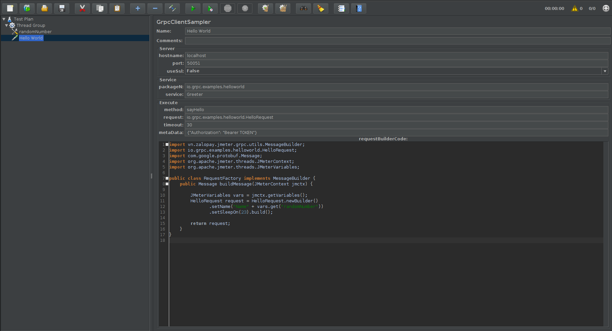
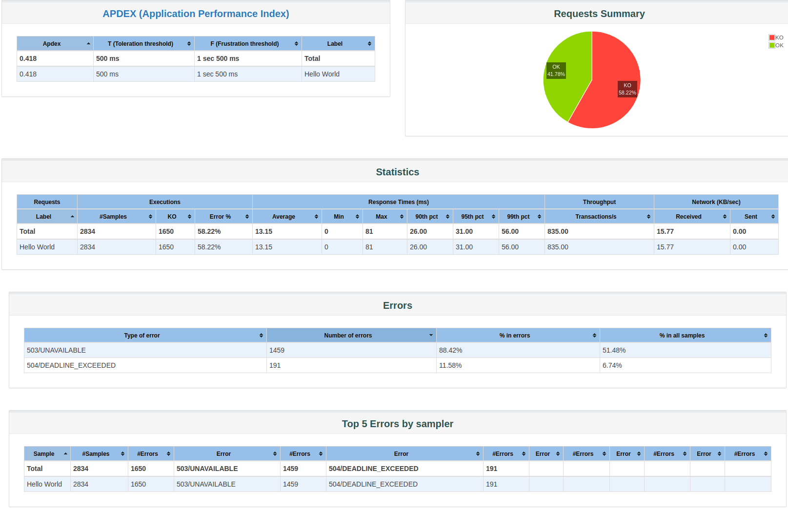

# JMeter gRPC Plugin

A JMeter plugin supports load test grpc service.

## Installation

```sh
$ mvn clean install
$ cp target/jmeter-grpc-client-sampler.jar path/to/jmeter/lib/ext
```

## Usage

> *Note*: Please read [example](./docs/example/README.md) first if you want to skip the step by step below

**Step 1.** Create a ***.jar** which contains java code generated from  ***.proto** file  and copy to `jmeter/lib/ext`.

*Example:*

```sh
$ cp hello.proto grpc-lib/src/main/proto/
$ cd grpc-lib && mvn package
$ cp target/grpc-lib-0.0.1.jar ../apache-jmeter-5.2/lib/ext/
```

**Step 2.** Create test plan :
  *  `TestPlan > Add > Thread (Users) > Thread Group`
  * `Thread Group > Add > Sampler > GRPC Client Sampler`
  * Config host, port, package, service... (see [more](docs/description.md))
  * Save your test plan with name <your_test_script>.jmx
  * Example: [hello.jmx](./docs/example/hello.jmx)
<div align="center">
    
</div>

### Run

```sh
# view all command in jmeter
$ jmeter/bin/jmeter.sh -h

# running load test
$ jmeter/bin/jmeter.sh -n -t <your_test_script>.jmx -l <result_file>.csv

# generate report
$ jmeter/bin/jmeter.sh -g <result_file>.csv -o <report>
```

### Report

<div align="center">
    
</div>


## Acknowledgements

Thanks to @A1Darkwing (Thanh Tran), @anhldbk (Anh Le), @VoxT (Thieu Vo) who dedicated to help me review and refactor the source code of project.

If you would like to work with the simple request by json, see [jmeter-grpc-request](https://github.com/zalopay-oss/jmeter-grpc-request)